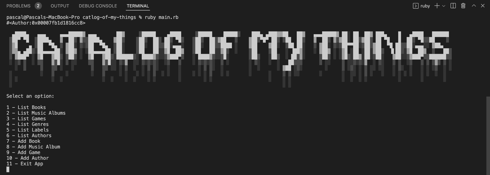

# Catalog of Things

> In this project, we created a console app that will help you to keep a record of different types of things you won: books, music albums, movies, and games. Everything is be based on the UML class diagram presented. The data will be stored in JSON files but we also prepared a database with tables structure analogical to the program's class structure.

## Screenshot



## Prerequisites

Ruby >= 3.0.0
Rspec

## Getting Started

To get a local copy up and running follow these simple example steps.

#### Clone this repository

```bash
git clone git@github.com:vikipretium/catalog-of-my-things.git

cd catalog-of-my-things
```

- With Ruby installed in your environment, you can run `ruby main.rb` to see some tests going on with the code

## Tests

- To run tests first install Rspec with `gem install rspec`
- inside the repo's root folder run `rspec spec `to see the tests in action

## Author

👤 **Vignesh**

- GitHub: [@vikipretium](https://github.com/vikipretium)
- Twitter: [@vikipretium](https://twitter.com/vikipretium)
- LinkedIn: [vikipretium](https://linkedin.com/in/vikipretium)

👤 **Pascal Kabika Mp**

- GitHub: [Paskab012](https://github.com/KABIKA681?tab=overview&from=2021-12-01&to=2021-12-31)
- LinkedIn: [LinkedIn](https://www.linkedin.com/in/pascal-kabika-443061220/)

👤 **Temitope Ogunleye**

- GitHub: [@topeogunleye](https://github.com/topeogunleye)
- Twitter: [@tope_leye](https://twitter.com/tope_leye)
- LinkedIn: [ogunleye](https://linkedin.com/in/ogunleye)

Contributions, issues, and feature requests are welcome!

Feel free to check the [issues page](../../issues/).

## Show your support

Give a ⭐️ if you like this project!

## Acknowledgments

- Add refereces and acknowlegements

## 📝 License

This project is [MIT](./MIT.md) licensed.
